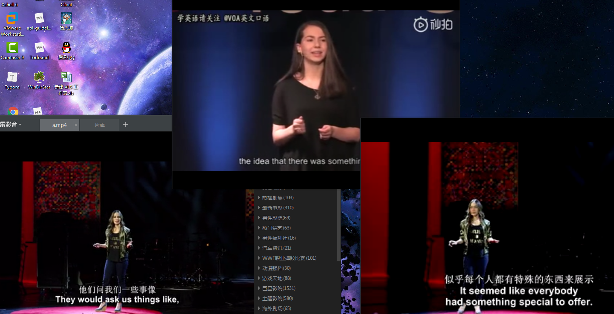
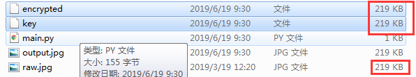

# Useful-Share
This repo share some useful things.

### VSCode Configuration for C/C++

[Here](https://blog.csdn.net/bat67/article/details/81268581) is the most useful reference for it. Others are trash.

In my repo, you can copy the .vscode to your workplace, and replace your gdb road in launch.json

### Latex template

The LatexTemplate.tex is for weekly report.

### Faceswap playing

[Here](<https://github.com/deepfakes/faceswap>) is the original repo and [here](<https://zhuanlan.zhihu.com/p/46810764>) is some useful guide for windows playing with it.

And below is my result with 9 hours' trainning on my trash desktop. The left and the top is the original video from TED, and the right is the merged video. You can see there is some effect... It' s interesting.

### Merge many repositories on github

~~~git
cd repo1
git remote add other ../repo2
git fetch other
git checkout -b repo2 other/master
git checkout master
git merge repo2 --allow-unrelated-histories
~~~

Any question can refer to [here](<https://sabrinaluo.github.io/tech/2015/12/24/how-to-merge-repos-with-git/>) and [here](<https://my.oschina.net/u/2007323/blog/1860305>).

### Python encrypt and decrypt file of any form

raw file:

and after encrypted, get two file with the same size of the raw file

and then decrypt the encrypted file with the key, get output file

